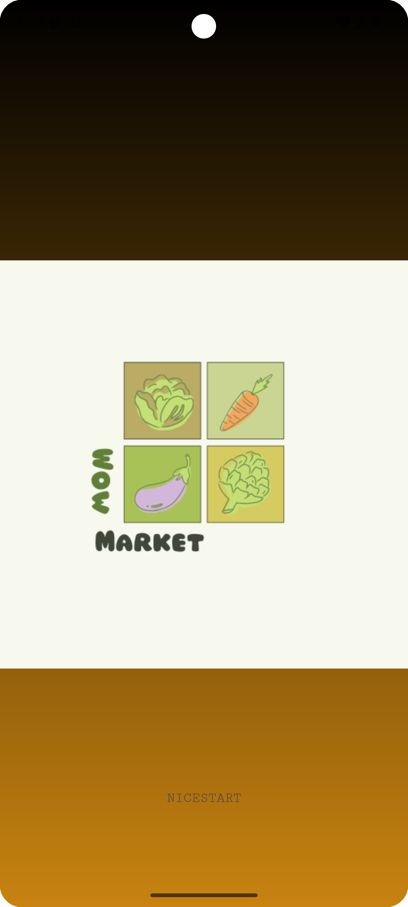
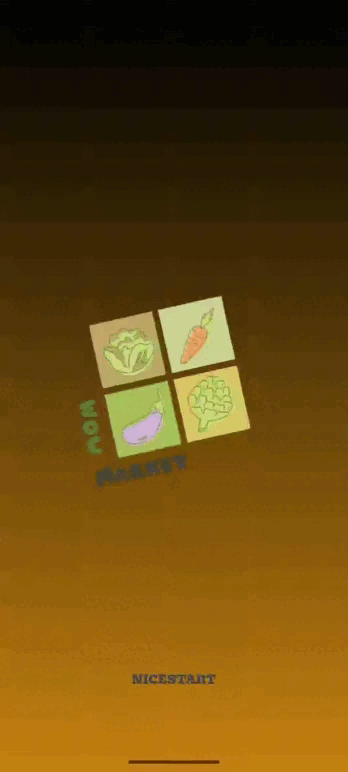
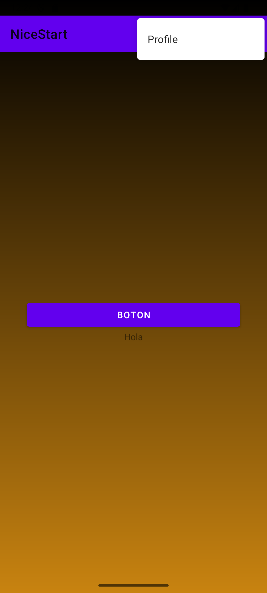

# 🌟 **NiceStart**

## Introducción

Este **repositorio** mostrará los distintos avances que se vayan produciendo a lo largo del proyecto.

---

## Avances por Pantalla

### 📱 **Pantalla de Login**

En esta pantalla se pueden observar los botones de **registro** e **inicio de sesión** con una imagen de fondo y un fondo con gradiente.


---

### 📝 **Pantalla de Signup**

Esta pantalla contiene dos botones:

1. **Iniciar sesión**: Lleva a la actividad principal.
2. **Cancelar**: Regresa a la actividad de inicio.


---

### 🏠 **Pantalla Principal (Main)**

La actividad de la pantalla principal se encuentra **en desarrollo**.


---

### 👤 **Pantalla de Profile**

Se ha añadido la pantalla de **Profile**.


---

### 🎬 **Pantalla Splash**

La pantalla **Splash** da inicio a la aplicación.



---

### ✨ **Animaciones en la Activity Splash**

Se han añadido animaciones nuevas a la Activity del **Splash**.

**Animación:**



**Código Java:**

```java
public class Splash extends AppCompatActivity {
    @Override
    protected void onCreate(Bundle savedInstanceState) {
        super.onCreate(savedInstanceState);
        EdgeToEdge.enable(this);
        setContentView(R.layout.activity_splash);
        openApp();
        
        ImageView thunder = findViewById(R.id.logosplash);
        Animation myanim = AnimationUtils.loadAnimation(this, R.anim.rotate_ani);
        thunder.startAnimation(myanim);
    }
}
```


### ⚙️ **Actualización de la Pantalla Main**

Se añadió una **AppBar** con una opción para acceder a la **Activity de Profile**.



---
---

### 🔄 **Swipe Refresh**

Se añadió un **swipe refresh** que recarga un **WebView** con una página web en cada refresco.


---

### 💬 **Diálogo Modal**

Se ha implementado un **Diálogo Modal**.


---

### 🛠️ **Menú Contextual**

Se implementó un **Menú Contextual** en el botón **"BUG"** que abre una pestaña llamada **Settings**.


---

## 🚨 **Importante**

Este README está sujeto a cambios.  

---

## Licencia

Este repositorio está **licenciado bajo Alex Riofrio**...


