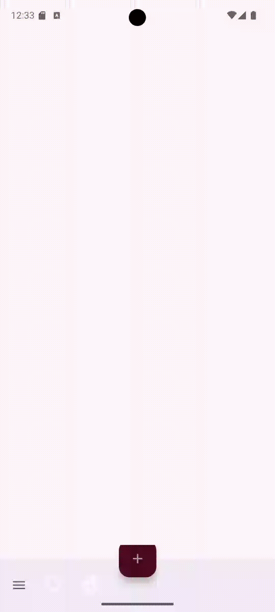
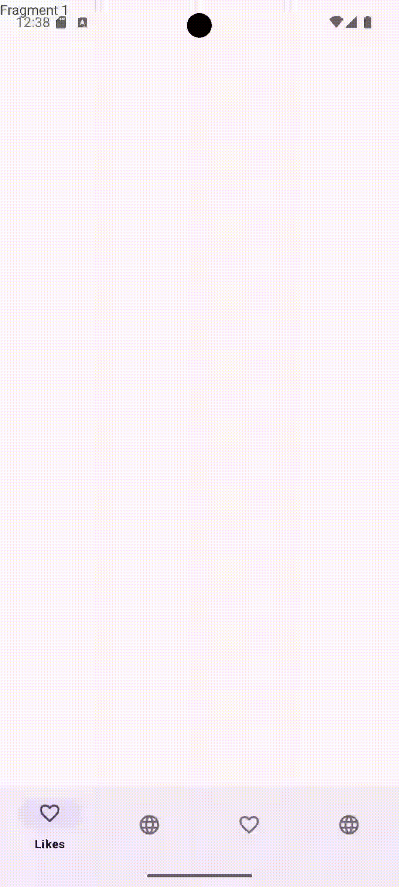

# 🌟 **NiceStart**

## Introducción

Este **repositorio** mostrará los distintos avances que se vayan produciendo a lo largo del proyecto.

---

## Avances por Pantalla

### 📱 **Pantalla de Login**

En esta pantalla se pueden observar los botones de **registro** e **inicio de sesión** con una imagen de fondo y un fondo con gradiente.


---

### 📝 **Pantalla de Signup**

Esta pantalla contiene dos botones:

1. **Iniciar sesión**: Lleva a la actividad principal.
2. **Cancelar**: Regresa a la actividad de inicio.


---

### 🏠 **Pantalla Principal (Main)**

La actividad de la pantalla principal se encuentra **en desarrollo**.


---

### 👤 **Pantalla de Profile**

Se ha añadido la pantalla de **Profile**.


---

### 🎬 **Pantalla Splash**

La pantalla **Splash** da inicio a la aplicación.


---

### ✨ **Animaciones en la Activity Splash**

Se han añadido animaciones nuevas a la Activity del **Splash**.

**Animación:**


**Código Java:**

```java
public class Splash extends AppCompatActivity {
    @Override
    protected void onCreate(Bundle savedInstanceState) {
        super.onCreate(savedInstanceState);
        EdgeToEdge.enable(this);
        setContentView(R.layout.activity_splash);
        openApp();

        ImageView thunder = findViewById(R.id.logosplash);
        Animation myanim = AnimationUtils.loadAnimation(this, R.anim.rotate_ani);
        thunder.startAnimation(myanim);
    }
}
```


### ⚙️ **Actualización de la Pantalla Main**

Se añadió una **AppBar** con una opción para acceder a la **Activity de Profile**.


---
---

### 🔄 **Swipe Refresh**

Se añadió un **swipe refresh** que recarga un **WebView** con una página web en cada refresco.


---

### 💬 **Diálogo Modal**

Se ha implementado un **Diálogo Modal**.


---

### 🛠️ **Menú Contextual**

Se implementó un **Menú Contextual** en el botón **"BUG"** que abre una pestaña llamada **Settings**.


---
### **Button Action Bar**

Se ha implementado una barra en la zona inferior de la pantalla para poder usar los botones del componente y se abre un desplegable con más opciones



---
### **Button Navigation**

Con este componente podemos navegar entre los distintos fragments que hemos creado, se necesita una activity ViewPager en la cual no escribiremos nada.

En el MainBn.xml ira este código:
```xml
<?xml version="1.0" encoding="utf-8"?>  
<androidx.coordinatorlayout.widget.CoordinatorLayout xmlns:android="http://schemas.android.com/apk/res/android"  
  xmlns:app="http://schemas.android.com/apk/res-auto"  
  xmlns:tools="http://schemas.android.com/tools"  
  android:id="@+id/main"  
  android:layout_width="match_parent"  
  android:layout_height="match_parent"  
  tools:context=".MainBn">  
 <androidx.viewpager.widget.ViewPager  android:id="@+id/view_pager"  
  android:layout_width="match_parent"  
  android:layout_height="match_parent"  
  app:layout_behavior="@string/appbar_scrolling_view_behavior">  
  
 </androidx.viewpager.widget.ViewPager> <com.google.android.material.bottomnavigation.BottomNavigationView  android:id="@+id/bottom_navigation"  
  android:layout_width="match_parent"  
  android:layout_height="wrap_content"  
  android:layout_gravity="bottom"  
  app:menu="@menu/bottom_navigation_menu"  
  />  
</androidx.coordinatorlayout.widget.CoordinatorLayout>
 ```

En la clase del Button Navigation debemos poner este código
```java
private SectionPagerAdapter sectionsPagerAdapter;  
private MenuItem prevMenuItem;
  sectionsPagerAdapter = new SectionPagerAdapter(this, getSupportFragmentManager());  
//        ViewPager viewPager = binding.viewPager;  
  ViewPager viewPager1 = findViewById(R.id.view_pager);  
        viewPager1.setAdapter(sectionsPagerAdapter);  
  
        BottomNavigationView mybottomNavView = findViewById(R.id.bottom_navigation);  
  
        mybottomNavView.setOnNavigationItemSelectedListener(new BottomNavigationView.OnNavigationItemSelectedListener() {  
            @Override  
  public boolean onNavigationItemSelected(@NonNull MenuItem item) {  
  
                if (item.getItemId() == R.id.heart) {  
  
                    item.setChecked(true);  
                    Toast.makeText(MainBn.this, "Likes clicked.", Toast.LENGTH_SHORT).show();  
  
                    viewPager1.setCurrentItem(0);  
                    return true;  
                }  
                if (item.getItemId() == R.id.search) {  
                    item.setChecked(true);  
                    Toast.makeText(MainBn.this, "Add clicked.", Toast.LENGTH_SHORT).show();  
  
                    viewPager1.setCurrentItem(1);  
                    return true;  
                }  
                if (item.getItemId() == R.id.heart2) {  
                    item.setChecked(true);  
                    Toast.makeText(MainBn.this, "Browse clicked.", Toast.LENGTH_SHORT).show();  
  
                    viewPager1.setCurrentItem(2);  
                    return true;  
                }  
                if (item.getItemId() == R.id.search2) {  
                    item.setChecked(true);  
                    Toast.makeText(MainBn.this, "Personal clicked.", Toast.LENGTH_SHORT).show();  
                    viewPager1.setCurrentItem(3);  
                    return true;  
                }  
  
                return false;  
            }  
        });  
  
        viewPager1.addOnPageChangeListener(new ViewPager.OnPageChangeListener() {  
            @Override  
  public void onPageScrolled(int position, float positionOffset, int positionOffsetPixels) {  
  
            }  
  
            @Override  
  public void onPageSelected(int position) {  
                if (prevMenuItem != null) {  
                    prevMenuItem.setChecked(false);  
                } else {  
                    mybottomNavView.getMenu().getItem(0).setChecked(false);  
                    mybottomNavView.getMenu().getItem(position).setChecked(true);  
                    //removeBadge(mybottomNavView, mybottomNavView.getMenu().getItem(position).getItemId());  
  }  
            }  
  
            @Override  
  public void onPageScrollStateChanged(int state) {  
  
            }  
  
  
        });
```

Debería de quedarte algo como este video ->



 
---

## 🚨 **Importante**

Este README está sujeto a cambios.

---

## Licencia

Este repositorio está **licenciado bajo Alex Riofrio**...


